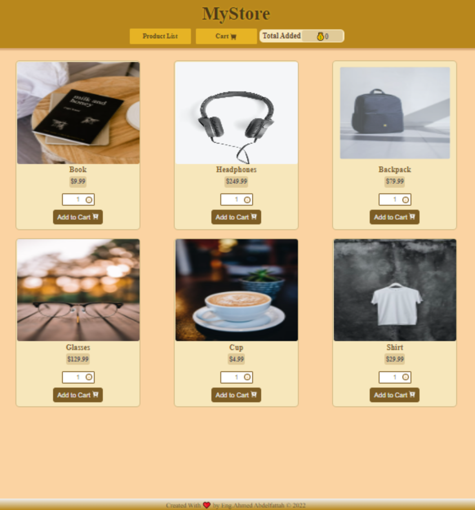
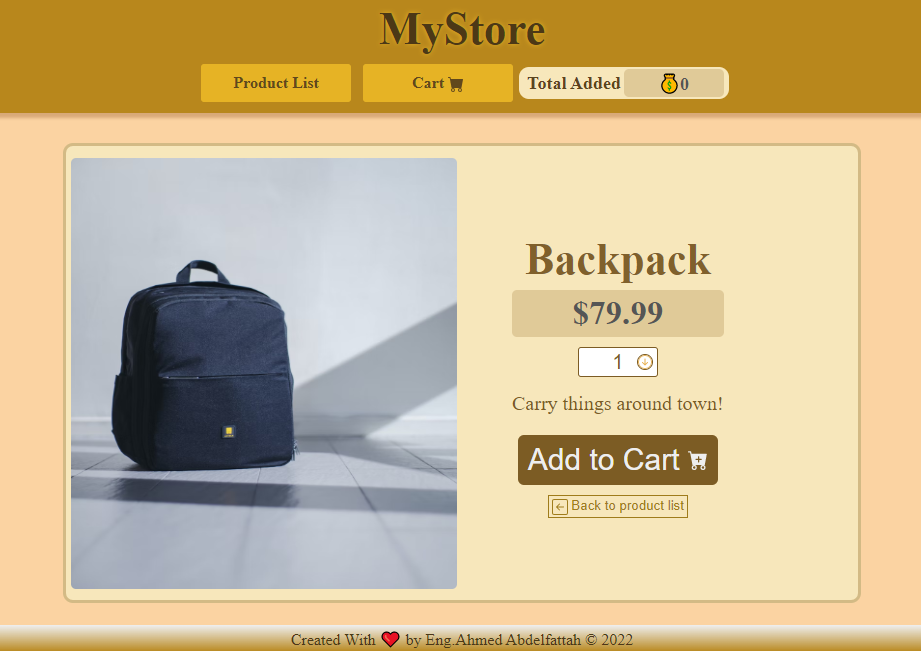
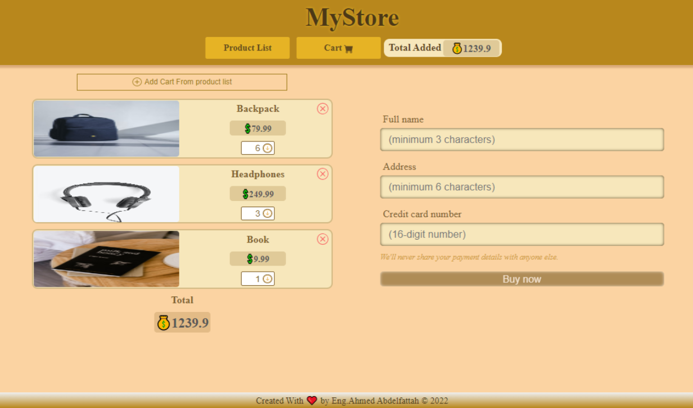
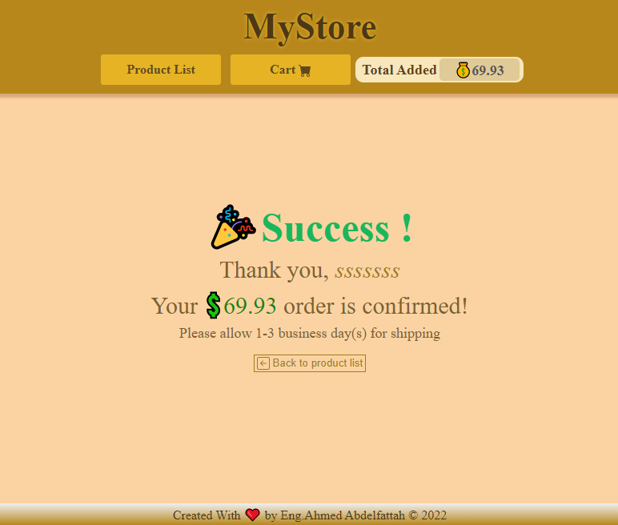
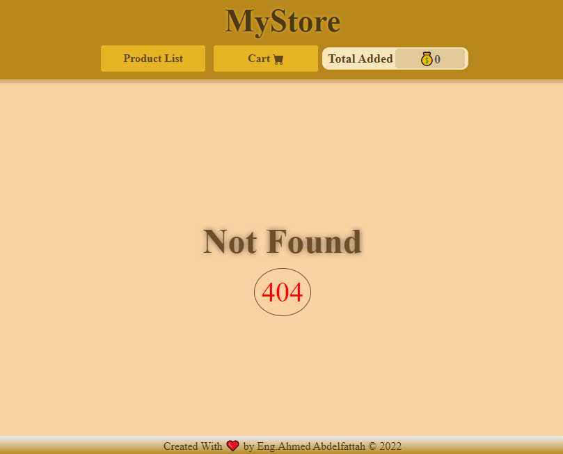

# 🛒 MY STORE APP

My store app is the first project of my Udacity Angular Development Cross-Skilling . Click the link below for more information on the course.

[Udacity Angular Development Cross-Skilling](https://egfwd.com/specializtion/angular/)

This course is provided by Scholarship Egypt FWD

## 📝 Paper Information

- Title: `MY STORE`
- Author: `Ahmed Mahmoud Abdelfattah`
- My store app is published at : [https://engahmedabdelfattah.github.io/myStore](https://engahmedabdelfattah.github.io/myStore)

## 💻 Install

- **The first step**: I did was start with a fresh Create Angular App instance to use the lasted version of Angular
- the commends for install Angular with Angular-CLI

  ```
  npm install -g @angular/cli

  ng new my-first-project

  cd my-first-project

  ng serve
  ```

- **The Second step**: I Clear content of some file :

  ```
  |—— src
    |—— app.component.html
  ```

  -and Change favicon with my favicon

  ```
  |—— src
    |—— favicon.ico
  ```

  -and delete All test files because it was optional.

- **The third step**: I change Hierarchy of folder to fit this App:
  **and you can see all Directory Hierarchy in section of it**

- **The fourth step**: I copied file of data.json which contain Data of product items from assets in [start repository](https://github.com/udacity/nd-0067-c3-angular-fundamentals-project-starter/tree/main/src/assets) from Udacity GitHup and add them to assets folder in src folder
- The fourth step: I init new git repo on my-reads folder
  ```
  git init
  git commit -m "first commit"
  git branch -M main
  ```
- **The fifth step**: I created new repo on my GitHup account and add to my local repo
  ```
  git remote add origin git@github.com:ahmed-ENDless/22.git
  git push -u origin main
  ```
- **The sixth step**: I use Angular-router package which automatically install when create app and I used it to route in this app

- **The seventh step**: I use Rxjs package which automatically install when create app and I fetch Data from data.json
- **The eighth step**: After end build the app I use npm package to build it to be ready to client use it
  ```
  npm run build
  ```

## 💽 Dependence

```
  "dependencies": {
    "@angular/animations": "^14.1.2",
    "@angular/common": "^14.1.0",
    "@angular/compiler": "^14.1.0",
    "@angular/core": "^14.1.0",
    "@angular/forms": "^14.1.0",
    "@angular/platform-browser": "^14.1.0",
    "@angular/platform-browser-dynamic": "^14.1.0",
    "@angular/router": "^14.1.0",
    "ngx-toastr": "^15.0.0",
    "rxjs": "~7.5.0",
    "tslib": "^2.3.0",
    "zone.js": "~0.11.4"
  },
```

```
  "devDependencies": {
    "@angular-devkit/build-angular": "^14.1.1",
    "@angular/cli": "~14.1.1",
    "@angular/compiler-cli": "^14.1.0",
    "@types/jasmine": "~4.0.0",
    "jasmine-core": "~4.2.0",
    "karma": "~6.4.0",
    "karma-chrome-launcher": "~3.1.0",
    "karma-coverage": "~2.2.0",
    "karma-jasmine": "~5.1.0",
    "karma-jasmine-html-reporter": "~2.0.0",
    "typescript": "~4.7.2"
  }

```

- you can install this dependence my use npm package by command
  ```
    npm install
  ```

## 🕹 Use

**The application consists of four pages:**

### 🏠 Product list (main page)

- the main page is the first page when open the app
- In this application, the main page displays a list of "products".
- _The three shelves are:_ </br>
  - Currently Reading </br>
  - Want to Read </br>
  - Read
- you can buy amount of product which you are want buy it by select amount option From Select Box then click on button add to cards.
- you will take feedback alert if the amount of product which you Select it added successfully.



### 🧾 Product Item Details page

- you can go to it if click on image of product in product list page.
- this page display the same information about product In addition to the description about product.



### ⭐ Cart page

- this page display all the information about cards Added and the total price for them.
- this page display form Consists of three felid which you should fill and submit by click on buy now button to To make your purchase successful.
- _The felid input are:_ </br>
  - full name </br>
  - Address </br>
  - Credit card number
- you can change, modify, exit your cards on this page before submit.



### 🚀 Success page

- if you submit by click on buy now button and your purchase successful, you navigate to success page.

- success page display your name and total price and button to back to product list page if you want buy another products.



### 🔍 Not found page

- if you write wrong path route in the address bar in your browser, it automatically navigate to not found page and display 404 error.
- if you try navigate to success page by write path of it in address bar, it also automatically navigate to not found page and display 404 error because no submit ocurred.



## ➡️ Directory Hierarchy

```
my-store
├─ .angular
├─ .browserslistrc
├─ .editorconfig
├─ .git
├─ .gitignore
├─ angular.json
├─ karma.conf.js
├─ package-lock.json
├─ package.json
├─ node_modules
├─ src
│  ├─ app
│  │  ├─ app.component.css
│  │  ├─ app.component.html
│  │  ├─ app.component.ts
│  │  ├─ app.module.ts
│  │  ├─ components
│  │  │  ├─ cart
│  │  │  │  ├─ cart-added
│  │  │  │  │  ├─ cart-added.component.css
│  │  │  │  │  ├─ cart-added.component.html
│  │  │  │  │  └─ cart-added.component.ts
│  │  │  │  ├─ cart-form
│  │  │  │  │  ├─ cart-form.component.css
│  │  │  │  │  ├─ cart-form.component.html
│  │  │  │  │  └─ cart-form.component.ts
│  │  │  │  ├─ cart.component.css
│  │  │  │  ├─ cart.component.html
│  │  │  │  └─ cart.component.ts
│  │  │  ├─ footer
│  │  │  │  ├─ footer.component.css
│  │  │  │  ├─ footer.component.html
│  │  │  │  └─ footer.component.ts
│  │  │  ├─ header
│  │  │  │  ├─ header.component.css
│  │  │  │  ├─ header.component.html
│  │  │  │  └─ header.component.ts
│  │  │  ├─ not-found
│  │  │  │  ├─ not-found.component.css
│  │  │  │  ├─ not-found.component.html
│  │  │  │  └─ not-found.component.ts
│  │  │  ├─ product-item-details
│  │  │  │  ├─ product-item-details.component.css
│  │  │  │  ├─ product-item-details.component.html
│  │  │  │  └─ product-item-details.component.ts
│  │  │  ├─ product-list
│  │  │  │  ├─ product-item
│  │  │  │  │  ├─ product-item.component.css
│  │  │  │  │  ├─ product-item.component.html
│  │  │  │  │  └─ product-item.component.ts
│  │  │  │  ├─ product-list.component.css
│  │  │  │  ├─ product-list.component.html
│  │  │  │  └─ product-list.component.ts
│  │  │  └─ success
│  │  │     ├─ success.component.css
│  │  │     ├─ success.component.html
│  │  │     └─ success.component.ts
│  │  ├─ Guard
│  │  │  └─ auth.guard.ts
│  │  ├─ models
│  │  │  └─ interfaces.model.ts
│  │  ├─ router
│  │  │  └─ app-routing.module.ts
│  │  └─ services
│  │     ├─ auth.service.ts
│  │     ├─ cards.service.ts
|  |     ├─ navigate.service.ts
|  |     ├─ select-amount.service.ts
|  |     ├─ form-data.service.ts
|  |     └─ json-data.service.ts
│  ├─ assets
│  │  ├─ .gitkeep
│  │  └─ data.json
│  ├─ environments
│  │  ├─ environment.prod.ts
│  │  └─ environment.ts
│  ├─ favicon.ico
│  ├─ index.html
│  ├─ main.ts
│  ├─ polyfills.ts
│  ├─ styles.css
│  └─ test.ts
├─ tsconfig.app.json
├─ tsconfig.json
└─ tsconfig.spec.json

```

## 🌲 Components tree

```
|——App
|  |—— header
|  |—— footer
|  |—— product-list
|    |—— product-list-item
|  |—— product-item-details
|  |—— cart
|    |—— cart-added
|    |—— cart-form
|  |—— success
|  |—— not-found

```

## 👨🏻‍💻 Code Details

- I used typescript.
- I used components to manage userInterface(UI).
- I used service to manage data and share it between components.
- I uses Guard/Auth to product routs.

## ↩️ References

### public Resources:

- [Angular Documentation](https://angular.io/docs)
- [rxjs Documentation](https://rxjs.dev/api)
- [Angular University site](https://angular-university.io/)

### Udacity Resources :

- [Project Rubric](https://review.udacity.com/#!/rubrics/3069/view)
- [Udacity HTML Style Guide](http://udacity.github.io/frontend-nanodegree-styleguide/index.html)
- [Udacity CSS Style Guide](http://udacity.github.io/frontend-nanodegree-styleguide/css.html)
- [Udacity JavaScript Style Guide](http://udacity.github.io/frontend-nanodegree-styleguide/javascript.html)
- [Udacity's Git Style Guide](https://udacity.github.io/git-styleguide/)

## 🔑 License

**This project is licensed under the terms of the [MIT](https://choosealicense.com/licenses/mit/) license.**

##

👋 I wish you a happy journey with books on our application

<!-- # **MYREADS APP** -->
